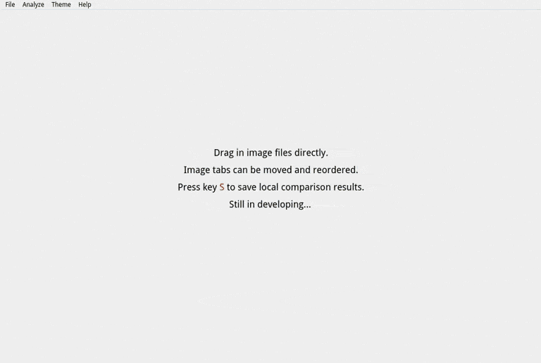
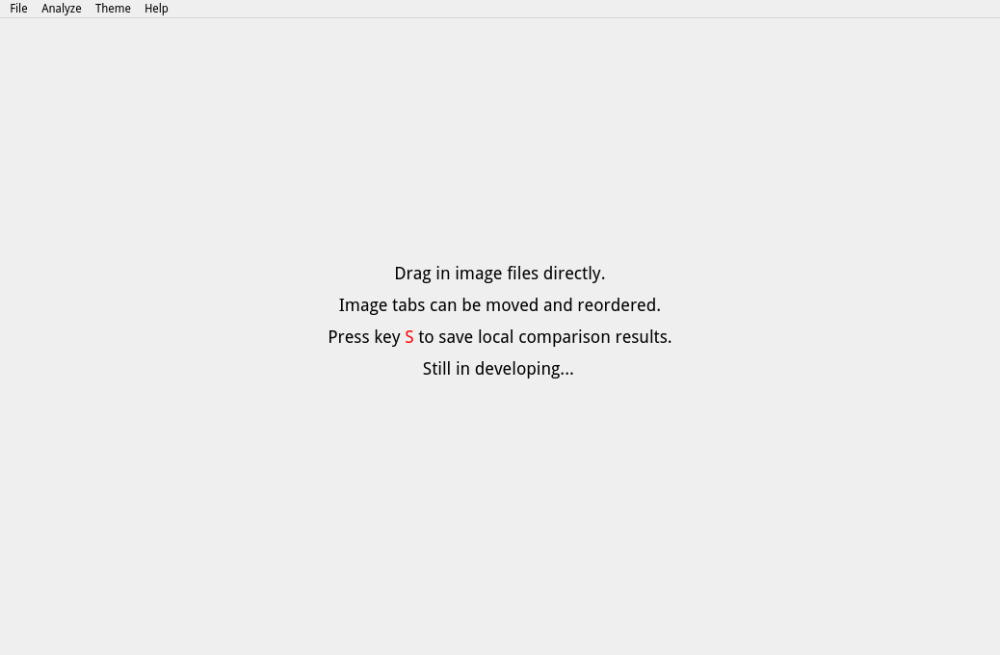
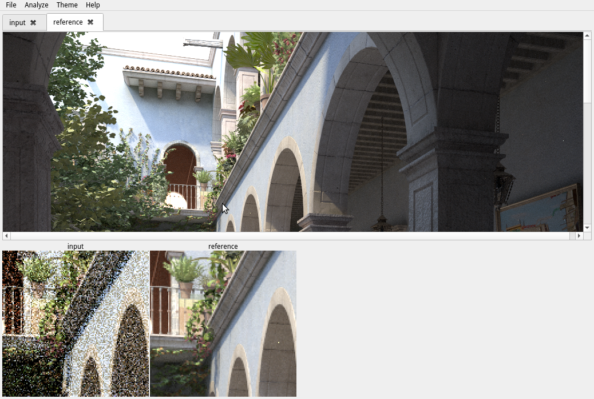
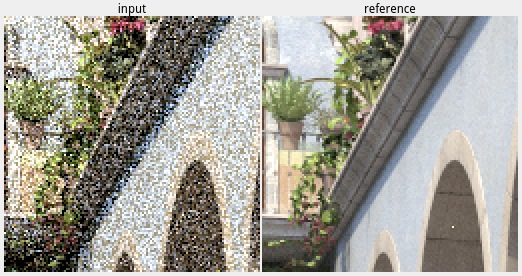
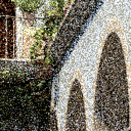
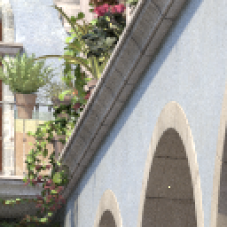

# ImCompare

Compare images locally.

- - -

* Initial window with instructions.

* Drag in image files directly. Move mouse cursor on images to compare local blocks at the same position.

* Press key `S` to save local comparison results:
  * A composite image file of all local blocks with names.
     
  * A sole image file of each local block.
     
     

* Still in developing...
