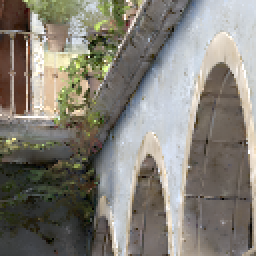
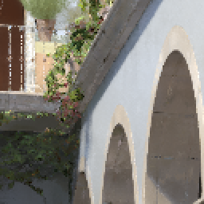

# ImCompare

Compare images locally.

- - -

* Initial window with instructions.

* Drag in file images directly. Move mouse cursor on images to compare local blocks of the same position.

* Press key `S` to save local comparison results.
	* A composite image file of all local images with image names.
	* A sole image file of each local image.

* Still in developing...
