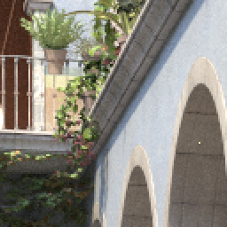

# ImCompare

Compare images locally.

- - -

* Initial window with instructions.

* Drag in image files directly. Move mouse cursor on images to compare local blocks at the same position.

* Press key `S` to save local comparison results.
	* A composite image file of all local blocks with names.
	* A sole image file of each local block.

* Still in developing...
