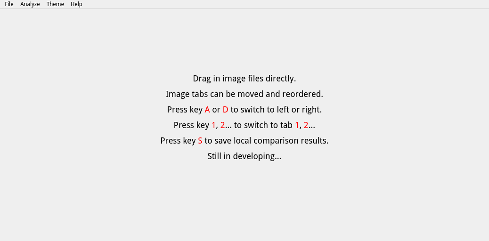
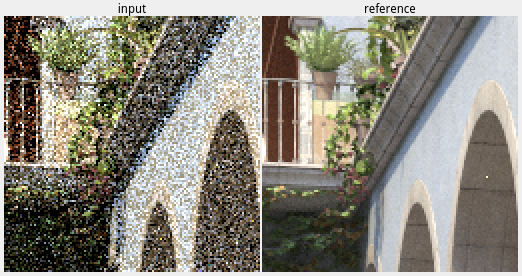
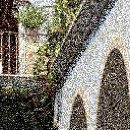

# ImCompare

Compare images locally.

Still in developing...

# Usage


* Initial window with instructions.



* Drag in image files directly. Move mouse cursor on images to compare local blocks at the same position.


* Press key `S` to save local comparison results:
  * A composite image file of all local blocks with names.
    <br/>
  * A sole image file of each local block.
    <br/>
    <br/>

# Build

* Clone the repository with the `--recursive` flag to get all the dependencies:
```bash
$ git clone --recursive https://github.com/chaosink/imcompare.git
```

* Or use `git submodule` to get all the dependencies after cloning the repository:
```bash
$ git submodule update --init --recursive
```

* Then use Qt Creator to open `src/imcompare.pro` and build.
